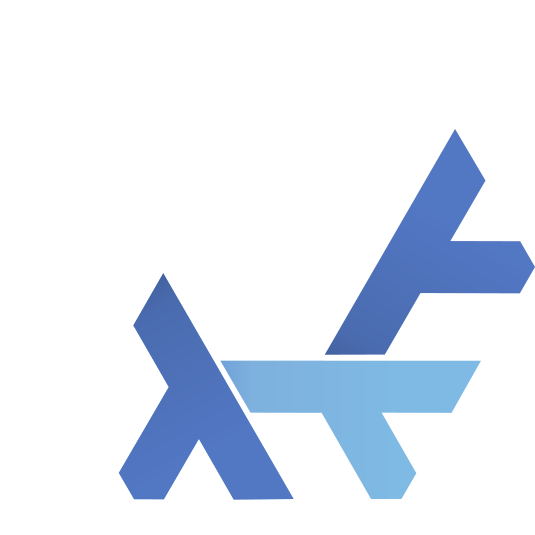

<h1 id="header" align="center">
  
   
  Nýx
</h1>

   My over-engineered NixOS flake: Desktops, laptops, servers and everything
   else that can run an OS. 

   
  <a href="#preface">Preface</a> 
  <a href="#high-level-overview">Overview</a> | <a href="#host-specifications">Hosts</a> | <a href="docs/installing.md">Installation</a>  
  <a href="#credits--special-thanks-to">Credits</a> | <a href="#license">License</a>  
  <a href="#cool-resources">Helpful Resources</a>
   

   
  
   
  Screenshot last updated <b>2024-03-19</b>

## Preface

Before you proceed, I would like to direct your attention to the
[credits](#credits) section below, where I pay tribute to the individuals who
have contributed to this project. Whether through code references, suggestions,
bug reports, or simply moral support, they have my most sincere gratitude.

### Disclaimer

[resources section]: #cool-resources
[nix blog]: https://blog.notashelf.dev
[license]: #license

<!-- deno-fmt-ignore-start -->

> [!CAUTION]
> As I constantly tinker and adjust my configuration, **nothing in
> this repository (including the README and overview sections) should be
> considered final**. Expect frequent changes, possibly on a daily basis, and
> quite likely in a half-broken state. This is my personal configuration, not a
> framework, so I make no promises of stability or support. If something breaks,
> it will be your responsibility.
>
> It is also worth noting that almost all configurations in this repository
> contain age-encrypted secrets. This means they **cannot** be built or
> replicated successfully unless you know how to revert age encryption. If you
> do, please let me know!
>
> There is a [resources section] that I strongly encourage you to check out,
> which you can use to start building your own configuration. I also document
> some of my experiences in my [nix blog] for your convenience. Feel free to
> dissect this configuration and borrow bits that interest you, but _please_
> respect my [license] while doing so!
>
> Do not be fooled by the extensive documentation effort that has gone into this
> project. I invite you to explore the modules and countless lines of Nix I have
> written, but I strongly advise against attempting to boot any of these
> configurations unless you are me.
>
> To reiterate: **this is not a public framework**, and **you should not try to
> run this configuration**, or rip off specific bits. It will cause you much
> pain and suffering, in addition to robbing you of the joys of learning
> something by yourself. By copying me, you would have to learn my specific
> design choices _on top of Nix/NixOS_, whereas you could create something that
> suits your own needs in a shorter time span.

<!-- deno-fmt-ignore-end -->

## High Level Overview

This is a high level overview of this monorepo, containing configurations for
**all** of my machines that are currently running NixOS, or have ran NixOS at
some point in time. You will find below a list of my hosts and their
specifications, accompanied by a somewhat maintained list of features of this
configuration and my design considerations.

### Repo Structure

[flake schemas]: https://determinate.systems/posts/flake-schemas
[Home-Manager]: https://github.com/nix-community/home-manager

- [`flake.nix`](flake.nix) Ground zero of my system configuration. Declaring
  entrypoints
- [`docs`](docs)The documentation for my flake repository
  - [`cheatsheet`](docs/cheatsheet.md) Useful tips that are hard to memorize,
    but easy to write down
  - [`installing`](docs/installing.md) Non-exhaustive Nix/NixOS tips
- [`parts/`](parts) Individual parts of my flake, powered by flake-parts
  - [`apps`](parts/apps) Basic executables for maintenance jobs
  - [`checks`](parts/checks) Additional checks to build on `nix flake check`
  - [`lib`](parts/lib) Personal library of functions and utilities
  - [`modules`](parts/modules) NixOS/Home-manager modules provided by my flake
    for both internal and public use
  - [`npins`](parts/npins) Additional pinned dependencies, managed via `npins`
  - [`pkgs`](parts/pkgs) Packages exported by my flake
  - [`pre-commit`](parts/pre-commit) pre-commit hooks via `git-hooks.nix`
  - [`templates`](parts/templates) Templates for initializing new flakes.
    Provides some language-specific flakes
  - [`args.nix`](parts/args.nix) Args that will be shared across, or exposed by
    the flake
  - [`deployments.nix`](parts/deployments.nix) Host setups for deploy-rs,
    currently a work in progress
  - [`fmt.nix`](parts/fmt.nix) Various formatting options for `nix fmt` and
    friends
  - [`iso-images.nix`](parts/iso-images.nix) Configurations for my home-built
    iso images, to be exposed in the flake schema
  - [`keys.nix`](parts/keys.nix) My public keys to be shared across the flake
  - [`shell.nix`](parts/shell.nix) Local devShell configurations
- [`homes`](homes) My personalized [Home-Manager] configurations.
- [`hosts`](hosts) Per-host configurations that contain machine specific
  instructions and setups
- [`modules`](modules) Modularized NixOS configurations
  - [`core`](modules/core) The core module that all systems depend on
    - [`common`](modules/core/common) Module configurations shared between all
      hosts (except installers)
    - [`profiles`](modules/core/profiles) Pluggable internal module system, for
      providing overrides based on host declarations (e.g. purpose)
    - [`roles`](modules/core/roles) A profile-like system that work through
      imports and ship predefined configurations
  - [`extra`](modules/extra) Extra modules that are rarely imported
    - [`shared`](modules/extra/shared) Modules that are both shared for outside
      consumption, and imported by the flake itself
    - [`exported`](modules/extra/exported) Modules that are strictly for outside
      consumption and are not imported by the flake itself
  - [`options`](modules/options) Definitions of module options used by common
    modules
    - [`meta`](modules/options/meta) Internal, read-only module that defines
      host capabilities based on other options
    - [`device`](modules/options/device) Hardware capabilities of the host
    - [`documentation`](modules/options/docs) Local module system documentation
    - [`system`](modules/options/system) OS-wide configurations for generic
      software and firmware on system level
    - [`style`](modules/options/style) Active style configurations ranging from
      QT theme to shell colors or icons
    - [`usrEnv`](modules/options/usrEnv) userspace exclusive configurations.
      E.g. lockscreen or package sets
- [`secrets`](secrets) Agenix secrets

### Notable Features

[theme options]: modules/options/style
[profiles]: modules/core/profiles
[wallpkgs]: https://github.com/notashelf/wallpkgs
[flake-parts]: https://flake.parts
[impermanence]: https://github.com/nix-community/impermanence

- **Flakes enabled** - leans heavily into flake-exclusive features of Nix
- **All-in-one** - Servers, desktops, laptops, virtual machines and anything you
  can think of. Managed in one place.
  - **Sane Defaults** - The modules attempt to bring the most sane defaults,
    while providing per-host toggles for conflicting choices.
  - **Flexible Modules** - Both Home-manager and NixOS modules allow users to
    retrieve NixOS or home-manager configurations from anywhere.
  - **Extensive Configuration** - Most desktop programs are configured out of
    the box and shared across hosts, with override options for per-host
    controls.
  - **Custom extended library** - An extended library for functions that help
    organize my system.
- **Shared Configurations** - Reduces re-used boilerplate code by sharing
  modules and profiles across hosts.
- **Fully Modular** - Utilizes NixOS' module system to avoid hard-coding any of
  the options.
  - **Profiles & Roles** - Provide serialized configuration sets and pluggables
    for easily changing large portions of configurations with less options and
    minimal imports.
  - **Detached Homes** - Home-manager configurations are able to be detached for
    non-NixOS usage.
  - **Modularized Flake Design** - With the help of [flake-parts], the flake is
    fully modular: keeping my `flake.nix` cleaner than ever.
  - **Declarative Themes** - Using my [theme options], [profiles] and
    [wallpkgs]. Everything theming is handled inside the flake.
  - **Tree-wide formatting** - Format files in any language with the help of
    devshells and treefmt-nix modules for flake-parts.
- **Declarative nftables firewall** - Flexible and over-engineered[^1]
  `nftables` table/chain builder abstraction for easy firewall setups.
- **Personal Installation Media** - Personalized ISO images for system
  installation and recovery.
- **Secrets Management** - Manage secrets through Agenix.
- **Opt-in Impermanence** - On-demand ephemeral root using BTRFS rollbacks and
  [impermanence].
- **Encryption Ready** - Supports and actively utilizes full disk encryption.
- **Wayland First** - Leaves Xorg in the past where it belongs. Everything is
  configured around Wayland, with Xorg only as a fallback.
- **Custom Xanmod Kernel** with a wide variety of patches to strip unneeded
  modules, and to provide platform specific optimizations for my desktop.

### Rules/Design Considerations

Most of those rules, so to speak, are quite obvious. However they are noted down
as a favor to potential contributors, and to potential observers who wish to
make sense of certain decisions that are made.

<!-- deno-fmt-ignore-start -->

[hosts directory]: hosts/README.md

> [!NOTE]
> Notes on host-specific design rules and considerations have been moved
> to the [hosts directory].

<!-- deno-fmt-ignore-end -->

- A commit should always be scoped/labeled. For example, while modifying a file
  in `hosts/enyo`, the commit would begin with `hosts/enyo:` followed by the
  description of the change.
- **alejandra** is the only Nix formatter that shall be used within this
  repository. nixfmt and nixpkgs-fmt both advertise ugly and confusing diffs,
  which I dislike. Some of Alejandra's quirks (e.g. lists) can be avoided with
  minor additions to the code.
- Backwards imports **should** be avoided wherever applicable.
- The repository should remain modular, and enabled options must **never**
  create inconsistencies or incompatibilities between hosts. In case of an
  unavoidable incompatibility, the issue must be documented. If possible,
  trigger conditions for incompatibilities must be avoided via assertions.
- Host-exclusive condition must **always** be placed in the host's own
  directory. Hosts **must** advertise their capabilities and features in
  `hosts/<hostname>/modules`
- `with lib;` **must** be avoided at all costs. Same goes for `with builtins;`
  which follows the same confusing pattern as `with lib;`. In some cases, `with`
  scopes may be accepted but only on the condition that the scope is narrow.
  - While accessing standard library functions, the call to library must be
    explicit. An example to this would be: `inherit (lib.modules) mkIf;` instead
    of repeating `lib.mkIf` or `lib.modules.mkIf` every time it is used.
  - `with pkgs;` _is_ fine, however its scope must be kept small. The biggest
    scope in which it shall be allowed is the smallest scope possible, e.g.,
    `environment.systemPackages = with pkgs; [ ];`. Anything larger than that
    should be avoided at all costs.

### Goals/Non-goals

#### Goals

I have a bunch of goals that I wish to accomplish by, and while working on this
repository. Those goals are:

- Provide _everything_ - we would like to provide modules, packages, system and
  home configurations all in one place
- Modularity - we would like to _never_ compromise on modularity, and two hosts
  of different purposes must _never_ conflict.
- Purity - `--impure` flag is a no-go.
- Documentation - anything that has been done should be documented. Best-effort
  not guaranteed.

#### Non-goals

- Full reproducibility - we contain secrets, therefore the setup is not fully
  reproducible.
- Compatibility - I do not intend to provide any kind of backwards compatibility
  for older Nix versions, or varying Nix forks.
- Replicability - this configuration does not aim to, and will not serve as a
  framework. I make no guarantees of replicability.
- Support - take a wild guess.
- Stability - see above.

## Host Specifications

<!-- deno-fmt-ignore-start -->

> [!WARNING]
> This section may be out of date as I constantly add, remove or re-purpose my
> hosts across a single network. Hostnames are assigned on a per-host basiis and
> are permanent, type and arch on another hand are subject to change.

<!-- deno-fmt-ignore-end -->

| Name         | Description                                                                                       |  Type   |     Arch      |
| :----------- | :------------------------------------------------------------------------------------------------ | :-----: | :-----------: |
| `enyo`       | Day-to-day desktop workstation boasting a full AMD system.                                        | Desktop | x86_64-linux  |
| `prometheus` | HP Pavilion with a a GTX 1050 and i7-7700hq                                                       | Laptop  | x86_64-linux  |
| `epimetheus` | Twin of prometheus, features full disk encryption in addition to everything prometheus provides   | Laptop  | x86_64-linux  |
| `hermes`     | HP Pavilion with a Ryzen 7 7730U, and my main portable workstation. Used on-the-go                | Laptop  | x86_64-linux  |
| `icarus`     | My 2014 Lenovo Yoga Ideapad that acts as a portable server, used for testing hardware limitations | Laptop  | x86_64-linux  |
| `helios`     | Hetzner Cloud VPS for non-critical infrastructure                                                 | Server  | x86_64-linux  |
| `selene`     | Alternative Hetzner Cloud VPS to be used as an aarch64-linux builder                              | Server  | aarch64-linux |
| `atlas`      | Proof of concept server host that is used by my Raspberry Pi 400                                  | Server  | aarch64-linux |
| `artemis`    | VM host for testing basic NixOS concepts. Previously targeted aarch64-linux                       |   VM    | x86_64-linux  |
| `apollon`    | VM host for testing networked services, generally used on servers                                 |   VM    | x86_64-linux  |
| `leto`       | VM host running medium-priority infrastructure inside a virtualized root server                   |   VM    | x86_64-linux  |
| `gaea`       | Custom live media, used as an installer                                                           |   ISO   | x86_64-linux  |
| `erebus`     | Air-gapped virtual machine/live-iso configuration for sensitive jobs                              |   ISO   | x86_64-linux  |

## Credits & Special Thanks

[atrocious abstractions]: parts/lib/builders.nix

My most sincere thanks go to [@fufexan](https://github.com/fufexan) for
convincing me to use NixOS and sticking around to answer my most stupid and
deranged questions, as well as my [atrocious abstractions]. Without his help, I
would not be able to stand where I do.

I also wish to extend my thanks to [@sioodmy](https://github.com/sioodmy) which
my configuration was initially based on. Though layouts and files have since
changed, the core principals and ideas remain. The simplicity of his
configuration flake allowed me to take a foothold in the Nix world.

Last but not least, I thank [@NobbZ](https://github.com/NobbZ) and
[@tejing1](https://github.com/tejing1) for their endless patience, critique and
willingness to show around the Nix ecosystem when I needed it the most. Many
pitfalls were avoided with their help, and many steps were taken forward with
their assistance.

### Awesome People

I got inspired by, and owe a lot to those folks

[sioodmy](https://github.com/sioodmy) - [fufexan](https://github.com/fufexan) -
[NobbZ](https://github.com/NobbZ) - [ViperML](https://github.com/viperML) -
[spikespaz](https://github.com/spikespaz) -
[hlissner](https://github.com/hlissner) -
[Max Headroom](https://github.com/max-privatevoid) -
[Lily Foster](https://github.com/lilyinstarlight)

... and surely there are more, but I tend to forget. Nevertheless, I extend my
thanks to all of those people and any others that I might have forgotten.

### Anti-credits

Pretend I haven't credited those people (but I will, because they are equally
awesome and I appreciate them)

[gerg-l (bald frog)](https://github.com/gerg-l) -
[eclairevoyant](https://github.com/eclairevoyant/) -
[FrothyMarrow](https://github.com/frothymarrow) -
[adamcstephens](https://github.com/adamcstephens) -
[nrabulinski](https://github.com/nrabulinski) -

### Honorable Mentions

Some of the cool people I have interacted with in the past and believe deserve a
shoutout for their support or companionship. I appreciate you all. :)

### The [wires gang](https://github.com/wires-org)

[fsnkty](https://github.com/fsnkty) - [lychee](https://github.com/itslychee) -
[germanbread](https://github.com/GermanBread) -
[marshmallow](https://github.com/mrshmllow/) -
[Zacc](https://github.com/zedseven) - [Michaili](https://github.com/MichailiK) -
[Sako](https://github.com/Sakooooo)

### Hyprland Community

[vaxry](https://github.com/vaxerski) -
[Vagahbond](https://github.com/Vagahbond) -
[jacekpoz](https://github.com/jacekpoz) -
[Raidenovich](https://github.com/raidenovich) -
[n3oney](https://github.com/n3oney) -

## Cool Resources

Resource that helped shape and improve this configuration, or resources that I
strongly recommend that you read in no particular order. Note that reading _any_
of those resources would be preferable to going through my config to learn.

### Official Manuals

As silly as manuals split over three different pages may sound, I encourage
everyone (including experts) to read those for comprehensive notes on
**packaging**, **program specific quirks & overrides** and other "pro-tips" on
Nix, Nixpkgs and NixOS.

You are invited to read about the module system in the NixOS manual before you
look into your own NixOS configuration.

- [Nix Manual](https://nix.dev/manual/nix)
- [NixOS Manual](https://nixos.org/manual/nixos/stable/)
- [Nixpkgs Manual](https://nixos.org/manual/nixpkgs/stable/)

### Interactive Pages

- [Tour of Nix](https://nixcloud.io/tour/?id=introduction/nix)
- [Noogle](https://noogle.dev)
- [NixOS package search](https://search.nixos.org/packages)
- [NixOS option search](https://search.nixos.org/options?)
- [Home-Manager option search](https://home-manager-options.extranix.com/)

### Readings

#### Blogs

Likely opinionated blog resources on Nix or Nix-centric processes. Nix knowledge
is best transferred via blogs on personal experience.

- [Astrid's blog](https://astrid.tech/t/nixos/)
- [Jade Lovelace's blog](https://jade.fyi/)
- [Xe Iaso's blog](https://xeiaso.net/blog)
- [viper's blog](https://ayats.org/)
- [Solène's blog](https://dataswamp.org/~solene)
- [Zimbatm's blog](https://zimbatm.com/notes)
- [Farid Zakaria's Blog](https://fzakaria.com/)
- [My own blog](https://blog.notashelf.dev)

#### Guides & Other Resources

Additional resources that you might want to check out before you begin your Nix
journey properly.

- [Zero to Nix](https://zero-to-nix.com/)
- [Nix Pills](https://nixos.org/guides/nix-pills/)
- [A list of Nix library functions and builtins](https://teu5us.github.io/nix-lib.html)

### Software

Software that helped this configuration become what it is, or software I find
interesting

**Linux**

- [Hyprland](https://github.com/hyprwm/Hyprland)
- [ags](https://github.com/aylur/ags)

**Nix/NixOS**

- [nix-super](https://github.com/privatevoid-net/nix-super)
- [Lix](https://lix.systems/about)
- [Agenix](https://github.com/ryantm/agenix)
- [nh](https://github.com/viperML/nh)

Projects I have made to use in this repository, or otherwise cool software that
are used in this repository that I have contributed to, or would like to
endorse.

- [nyxpkgs](https://github.com/notashelf/nyxpkgs) - my personal package
  collection
- [nvf](https://github.com/notashelf/nvf) - highly modular Neovim configuration
  framework for Nix/NixOS
- [schizofox](https://github.com/schizofox/schizofox) - hardened Firefox
  configuration for the delusional and the paranoid
- [ndg](https://github.com/feel-co/ndg) - a module documentation framework for
  Nix projects.

Additionally, take a look at my [personal blog](https://blog.notashelf.dev) for
my notes on Linux, and specifically challenging or tedious processes on Nix and
NixOS. Some of my notes have also been left in [the docs directory](docs/).

## License

<!-- Nobody reads those, why do I even bother... -->

Unless explicitly stated otherwise, all code and documentation found within in
this repository is licensed under the [GPLv3](LICENSE), or should you prefer,
under any later version of the GPL released by the FSF. Documentation and any
"creative" writing found in Markdown pages remain under the
[CC BY License](docs/LICENSE).

<!-- deno-fmt-ignore-start -->

The licenses entail that you must include a copyright notice inside your
repository, and disclose changes where applicable.

<!-- deno-fmt-ignore-end -->

All code here (excluding secrets) are available _for your convenience_ and _at
my own expense_ as I choose to keep my entire system configuration public. I
believe it is in Nix and NixOS community spirit to learn from and share code
with other NixOS users. As such if you are directly copying a section of my
configuration, please include a copyright notice at the top of the file you
import the code, or as a small comment above the section you have copied.

I cannot, _in any shape or form_ enforce my license on you, but I would like you
to know that I _really_ appreciate those who are kind enough to leave a link to
my configuration and uphold my license properly. Please do not be one of those
people who copy my commits without proper credit, as it is the only thing I can
ask for my efforts. Those who were kind and diligent enough to follow my
license, a _very_ big thank you.

  <a href="#readme">Back to the Top</a>
   

[^1]:
    I speak of "over-engineering" not as a flaw, but as a trait that can properly
    describe the time and effort that this repository has taken. After 700+ recorded
    hours and 4500+ commits, that is the only word that can describe this project.
