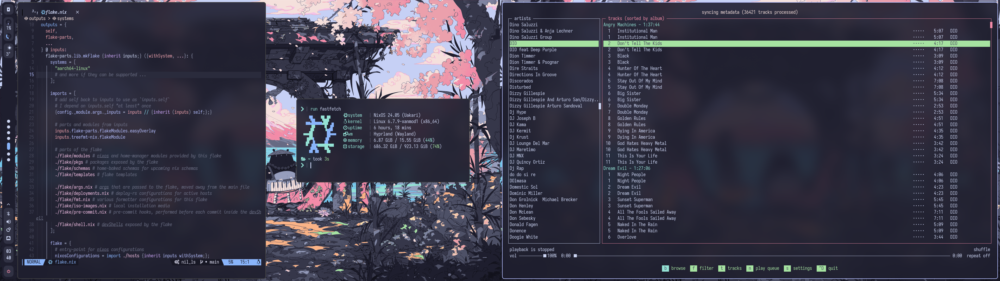
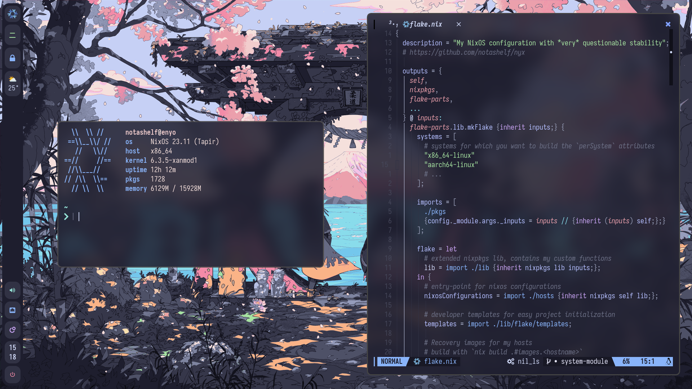

<h1 id="header" align="center">
  <!-- Make sure that the image path is always valid, despite however stupid a repo restructure might be. -->
  
   
  Nýx
</h1>

   My overengineered NixOS flake: Desktops, laptops, servers and everything
   else that can run an OS. 

   
  <a href="#high-level-overview">Overview</a> | <a href="#host-specifications">Hosts</a> | <a href="#credits--special-thanks-to">Credits</a> | <a href="#license">License</a> 
  <a href="https://www.youtube.com/watch?v=xvFZjo5PgG0">Installation</a>
   

   
  
   
  Screenshot last updated <b>2024-03-19</b>

## High Level Overview

A high level overview of this monorepo, containing configurations for **all** of
my machines that are running or have ran NixOS at some point in time. As I
physically cannot stop tinkering with my configuration, nothing in this
repository (including the overview sections) should be considered final. As
such, it is **not recommended to be used as a template** but you are welcome to
browse the codebase to your liking, you may find bits that are interesting
or/and useful to you.

<!-- deno-fmt-ignore-start -->

> [!CAUTION]
> Almost all of the configurations contained within this repository,
> in some shape or form, contain age encrypted secrets - which, to you dear
> reader, means that they **cannot** be built and replicated successfully, at
> least in theory. I invite you to go through the modules and countless lines of
> Nix I have written, but I would strongly advise against attempting to boot any
> of those configurations unless you are not me.

<!-- deno-fmt-ignore-end -->

_Before you proceed, I would like to point you towards the [credits](#credits)
section below where I pay tribute to the individuals who have contributed to
this project, whether through code reference, suggestions, bug reports, or
simply moral support._

### Notable Features

[module options]: ./modules/options/style
[profiles]: ./modules/profiles
[wallpkgs]: https://github.com/notashelf/wallpkgs
[flake-parts]: https://flake.parts
[impermanence]: https://github.com/nix-community/impermanence

- **All-in-one** - Servers, desktops, laptops, virtual machines and anything you
  can think of. Managed in one place.
  - **Sane Defaults** - The modules attempt to bring the most sane defaults,
    while providing per-host toggles for conflicting choices.
  - **Flexible Modules** - Both Home-manager and NixOS modules allow users to
    retrieve NixOS or home-manager configurations from anywhere.
  - **Extensive Configuration** - Most desktop programs are configured out of
    the box and shared across hosts, with override options for per-host
    controls.
  - **Custom extended library** - An extended library for functions that help
    organize my system.
- **Shared Configurations** - Reduces re-used boilerplate code by sharing
  modules and profiles across hosts.
- **Fully Modular** - Utilizes NixOS' module system to avoid hard-coding any of
  the options.
  - **Profiles & Roles** - Provide serialized configuration sets and pluggables
    for easily changing large portions of configurations with less options and
    minimal imports.
  - **Detached Homes** - Home-manager configurations are able to be detached for
    non-NixOS usage.
  - **Modularized Flake Design** - With the help of [flake-parts], the flake is
    fully modular: keeping my `flake.nix` cleaner than ever.
  - **Declarative Themes** - Using my [module options], [profiles] and
    [wallpkgs]. Everything theming is handled inside the flake.
  - **Tree-wide formatting** - Format files in any language with the help of
    devshells and treefmt-nix modules for flake-parts.
- **Declarative nftables firewall** - Flexible and overengineered[^1] `nftables`
  table/chain builder abstraction for easy firewall setups.
- **Personal Installation Media** - Personalized ISO images for system
  installation and recovery.
- **Secrets Management** - Manage secrets through Agenix.
- **Opt-in Impermanence** - On-demand ephemeral root using BTRFS rollbacks and
  [impermanence].
- **Encryption Ready** - Supports and actively utilizes full disk encryption.
- **Wayland First** - Leaves Xorg in the past where it belongs. Everything is
  configured around Wayland, with Xorg only as a fallback.

### Repo Structure

[flake schemas]: https://determinate.systems/posts/flake-schemas
[Home-Manager]: https://github.com/nix-community/home-manager

- [flake.nix](flake.nix) Ground zero of my system configuration. Declaring
  entrypoints
- [docs](docs)The documentation for my flake repository
  - [notes](docs/notes) Notes from tedious or/and under-documented processes I
    have gone through. More or less a blog
  - [cheatsheet](docs/notes/cheatsheet.md) Useful tips that are hard to
    memorize, but easy to write down
- [flake/](flake) Individual parts of my flake, powered by flake-parts
- [lib](lib) Personal library of functions and utilities
  - [apps](flake/apps) Basic executables for maintenance jobs
  - [checks](flake/checks) Additional checks to build on `nix flake check`
  - [lib](flake/lib) Personal library of functions and utilities
  - [modules](flake/modules) Modules provided by my flake for both internal and
    public use
  - [npins](flake/npins) Additional pinned dependencies, managed via `npins`
  - [pkgs](flake/pkgs) Packages exported by my flake
  - [pre-commit](flake/pre-commit) pre-commit hooks via `git-hooks.nix`
  - [templates](flake/templates) Templates for initializing new flakes. Provides
    some language-specific flakes
  - [args.nix](flake/args.nix) Args that will be shared across, or exposed by
    the flake
  - [deployments.nix](flake/deployments.nix) Host setups for deploy-rs,
    currently a work in progress
  - [fmt.nix](flake/fmt.nix) Various formatting options for `nix fmt` and
    friends
  - [iso-images.nix](flake/iso-images.nix) Configurations for my home-built iso
    images, to be exposed in the flake schema
  - [keys.nix](flake/keys.nix) My public keys to be shared across the flake
  - [shell.nix](flake/shell.nix) Local devShell configurations
- [homes](homes) My personalized [Home-Manager] configurations.
- [hosts](hosts) Per-host configurations that contain machine specific
  instructions and setups
- [modules](modules) Modularized NixOS configurations
  - [core](modules/common) The core module that all systems depend on
    - [common](modules/common) Module configurations shared between all hosts
      (except installers)
    - [profiles](modules/profiles) Pluggable internal module system, for
      providing overrides based on host declarations (e.g. purpose)
    - [roles](modules/roles) A profile-like system that work through imports and
      ship predefined configurations
  - [extra](modules/extra) Extra modules that are rarely imported
    - [shared](modules/extra/shared) Modules that are both shared for outside
      consumption, and imported by the flake itself
    - [exported](modules/extra/exported) Modules that are strictly for outside
      consumption and are not imported by the flake itself
  - [options](modules/options) Definitions of module options used by common
    modules
    - [meta](modules/options/meta) Internal, read-only module that defines host
      capabilities based on other options
    - [device](modules/options/device) Hardware capabilities of the host
    - [documentation](modules/options/docs) Local module system documentation
    - [system](modules/options/system) OS-wide configurations for generic
      software and firmware on system level
    - [theme](modules/options/theme) Active theme configurations ranging from QT
      theme to shell colors
    - [usrEnv](modules/options/usrEnv) userspace exclusive configurations. E.g.
      lockscreen or package sets
- [secrets](secrets) Agenix secrets

## Host Specifications

| Name         | Description                                                                                       |  Type   |     Arch      |
| :----------- | :------------------------------------------------------------------------------------------------ | :-----: | :-----------: |
| `gaea`       | Custom live media, used as an installer                                                           |   ISO   | x86_64-linux  |
| `erebus`     | Air-gapped virtual machine/live-iso configuration for sensitive jobs                              |   ISO   | x86_64-linux  |
| `enyo`       | Day-to-day desktop workstation boasting a full AMD system.                                        | Desktop | x86_64-linux  |
| `helios`     | Hetzner cloud VPS for non-critical infrastructure                                                 | Server  | x86_64-linux  |
| `atlas`      | Proof of concept server host that is used by my Raspberry Pi 400                                  | Server  | aarch64-linux |
| `prometheus` | HP Pavilion with a a GTX 1050 and i7-7700hq                                                       | Laptop  | x86_64-linux  |
| `epimetheus` | Twin of prometheus, features full disk encryption in addition to everything prometheus provides   | Laptop  | x86_64-linux  |
| `hermes`     | HP Pavilion with a Ryzen 7 7730U, and my main portable workstation. Used on-the-go                | Laptop  | x86_64-linux  |
| `icarus`     | My 2014 Lenovo Yoga Ideapad that acts as a portable server, used for testing hardware limitations | Laptop  | x86_64-linux  |
| `artemis`    | VM host for testing basic NixOS concepts. Previously targeted aarch64-linux                       |   VM    | x86_64-linux  |
| `apollon`    | VM host for testing networked services, generally used on servers                                 |   VM    | x86_64-linux  |
| `leto`       | VM host running medium-priority infrastructure inside a virtualized root server                   |   VM    | x86_64-linux  |

## Credits & Special Thanks to

[atrocious abstractions]: ./lib/builders.nix

My special thanks go to [fufexan](https://github.com/fufexan) for convincing me
to use NixOS and sticking around to answer my most stupid and deranged
questions, as well as my [atrocious abstractions].

And to [sioodmy](https://github.com/sioodmy) which my configuration is initially
based on. The simplicity of his configuration flake allowed me to take a
foothold in the Nix world.

### Awesome People

I ~~shamelessly stole from~~ got inspired by those folks

[sioodmy](https://github.com/sioodmy) - [fufexan](https://github.com/fufexan) -
[NobbZ](https://github.com/NobbZ) - [ViperML](https://github.com/viperML) -
[spikespaz](https://github.com/spikespaz) -
[hlissner](https://github.com/hlissner) -
[fortuneteller2k](https://github.com/fortuneteller2k) -
[Max Headroom](https://github.com/max-privatevoid)

... and surely there are more, but I tend to forget.

### Anti-credits

Pretend I haven't credited those people (but I will, because they are equally
awesome and I appreciate them)

[n3oney](https://github.com/n3oney) -
[gerg-l (bald frog)](https://github.com/gerg-l) -
[eclairevoyant](https://github.com/eclairevoyant/) -
[FrothyMarrow](https://github.com/frothymarrow) -
[Raidenovich](https://github.com/raidenovich)

### Other Cool Resources

Resource that helped shape and improve this configuration, or resources that I
strongly recommend that you read in no particular order.

#### Readings

- [A list of Nix library functions and builtins](https://teu5us.github.io/nix-lib.html)
  - [Noogle](https://noogle.dev)
- [Zero to Nix](https://zero-to-nix.com/)
- [Nix Pills](https://nixos.org/guides/nix-pills/)
- [Xe Iaso's blog](https://xeiaso.net/blog)
- [Vinícius Müller's Blog](https://viniciusmuller.github.io/blog)
- [Viper's Blog](https://ayats.org/)
- [Solène's Blog](https://dataswamp.org/~solene)
- [...my own "blog"?](https://notashelf.github.io/nyx/)

#### Software

Software that helped this configuration become what it is, or software I find
interesting

**Linux**

- [Hyprland](https://github.com/hyprwm/Hyprland)
- [ags](https://github.com/aylur/ags)

**Nix/NixOS**

- [Agenix](https://github.com/ryantm/agenix)
- [nh](https://github.com/viperML/nh)

Projects I have made to use in this repository, or otherwise cool software that
are used in this repository that I would like to endorse.

- [nyxpkgs](https://github.com/notashelf/nyxpkgs) - my personal package
  collection
- [nvf](https://github.com/notashelf/nvf) - highly modular Neovim configuration
  framework for Nix/NixOS
- [schizofox](https://github.com/schizofox/schizofox) - hardened Firefox
  configuration for the delusional and the paranoid
- [ndg](https://github.com/feel-co/ndg) - a module documentation framework for
  Nix projects.

Additionally, take a look at my [notes/blog](./docs/notes) for my notes on
Linux, and specifically challenging or tedious processes on Nix and NixOS. It is
also available [as a webpage](https://nyx.notashelf.dev)

## License

Unless explicitly stated otherwise, all code under this repository (except for
[anything in docs directory](docs)) is licensed under the [GPLv3](LICENSE), or
should you prefer, under any later version of the GPL released by the FSF.

The notes and documentation available in [docs directory](docs) is licensed
under the [CC BY License](docs/LICENSE).

<!-- deno-fmt-ignore-start -->

> [!NOTE]
> All code here (excluding secrets) are available for your convenience
> and _at my expense_ as I choose to keep my entire system configuration public.
> I believe it is in Nix and NixOS community spirit to learn from and share code
> with other NixOS users. As such if you are directly copying a section of my
> configuration, please include a copyright notice at the top of the file you
> import the code, or as a small comment above the section you have copied.

<!-- deno-fmt-ignore-end -->

It is not in any shape or form enforced, but your kindness and due diligence
would be highly appreciated.

---

<h2 align="center">Preview</h2>

   

   Screenshot last updated <b>2023-12-09</b>

  <a href="#readme">Back to the Top</a>

[^1]:
    I speak of overengineering not as a flaw, but as a trait that can properly
    describe the time and effort that this repository has taken. After 700+ recorded
    hours and 4000+ commits, that is the only word that can describe this project.
